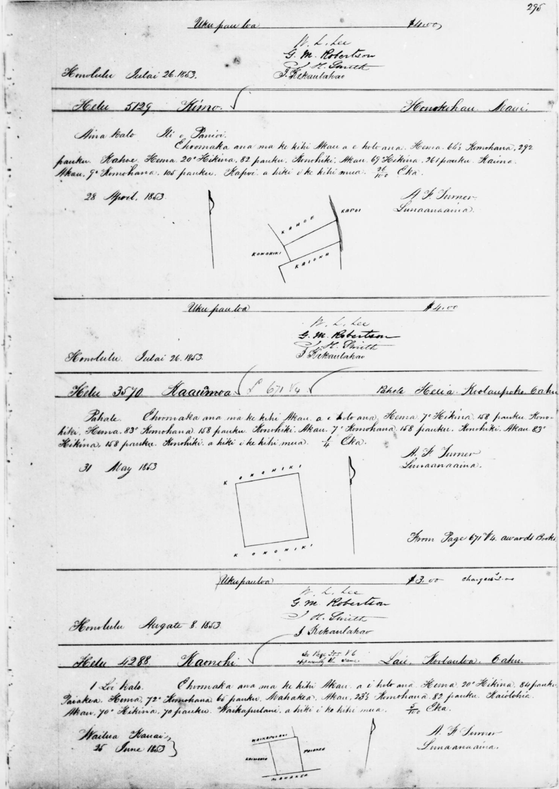
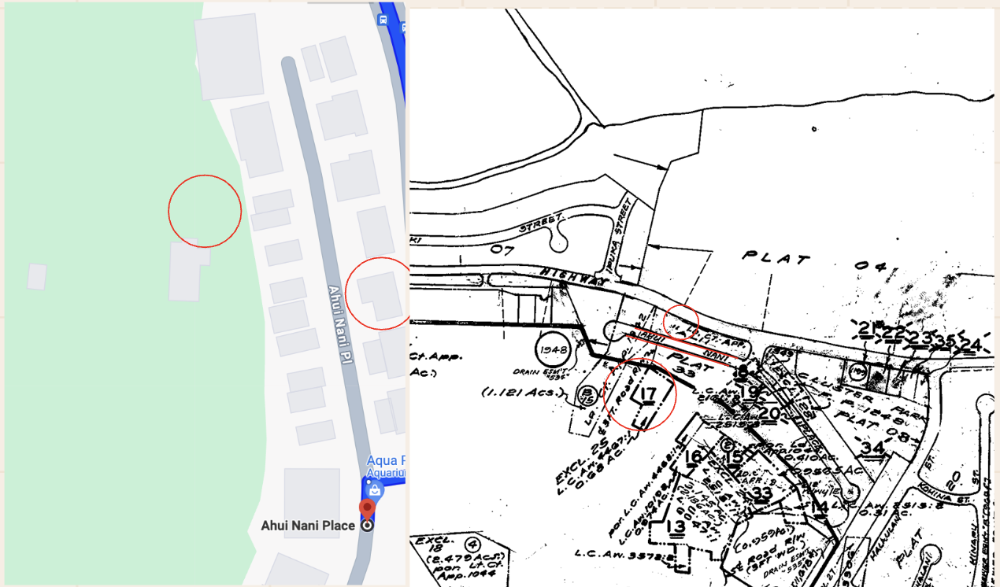
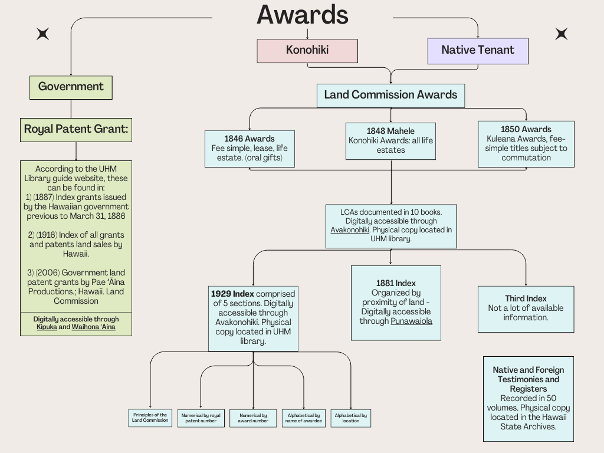

  
  
  

Over a 17-week period, I developed a comprehensive land title project focused on tracing the genealogy of land ownership from the time of the Great Mahele. Utilizing the 1929 indices of land awards, I tracked down data pertaining to the kuleana plot of my ancestor. Through this research, I was able to locate their land as well as identify two additional grants.

I translated foreign testimonies and surveyor notes from Hawaiian to English, ensuring accurate and thorough documentation. My investigation included identifying the current locations of these plots and tracing all subsequent sales, making detailed notes of ownership changes over time.

To support my findings, I sourced all relevant TMKs (Tax Map Key numbers) that contained essential data. This process involved visits to the Hawaiʻi State Archives, the Bureau of Conveyances, and the Land Court to obtain physical documents, ensuring the authenticity and completeness of my research.

A full presentation, along with all related documents and data entries, is available via email upon request.

Source: <a href="https://github.com/your-github-repo"><i class="large github icon"></i>your-github-repo</a>
