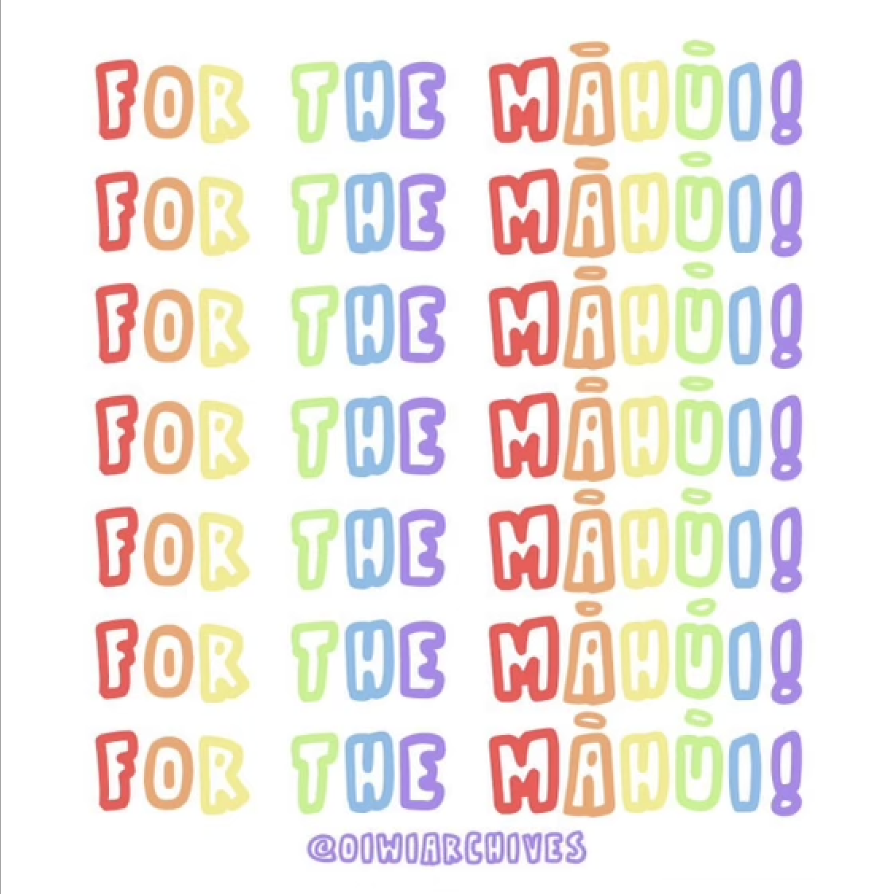
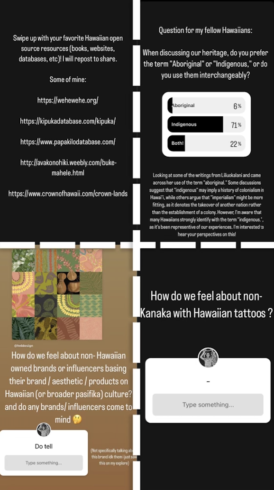
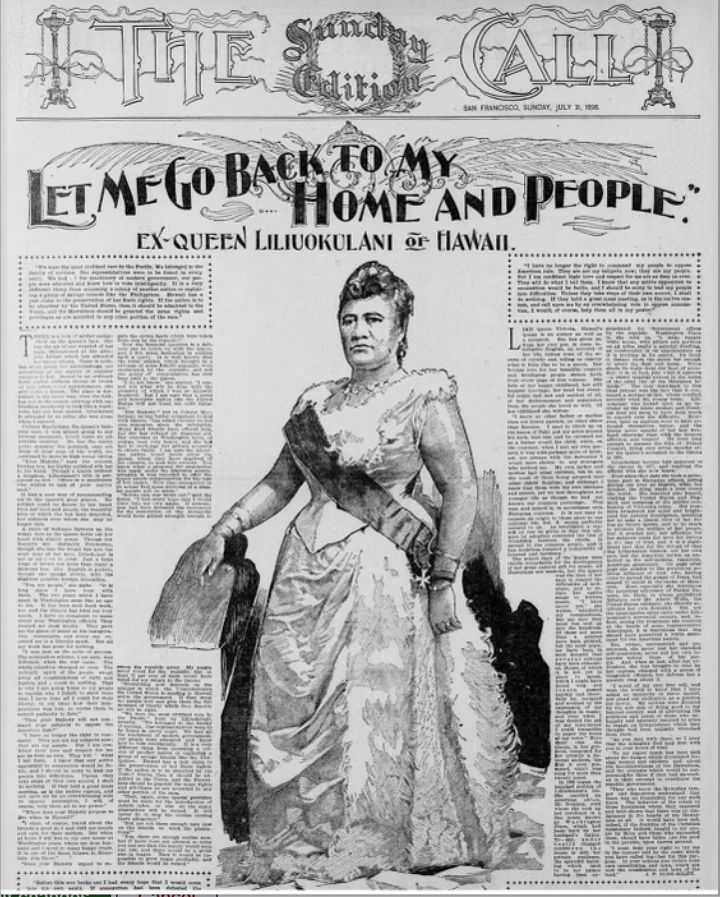

  
  
  

Oiwi Archives Instagram page was initiated during a comprehensive research project where I discovered a treasure trove of historical materials, including newspaper articles, films, photography, and magazines that had faded into obscurity. My goal is to bring these lost pieces of Hawaiian history back into the spotlight, alongside discussing contemporary issues and advocacy relevant to Hawaii and the Pacific region.

On the Oiwi Archives page, followers can find a blend of historical content and modern commentary. I regularly share excerpts from my current readings, providing personal perspectives on the topics presented. This approach not only educates but also engages a diverse audience, fostering meaningful discussions.

The page has attracted over 800 followers, primarily from the United States, but also from New Zealand, Japan, and Canada. Through connecting with Indigenous communities globally, Oiwi Archives has become a platform for shared heritage and mutual support. Each week, the page reaches approximately 4,000 impressions, with 20% of these coming from followers.

Engagement is a cornerstone of Oiwi Archives. I frequently post questions and current events, inviting followers to participate in discussions. This interaction is shared with the community, creating a tight-knit group of Hawaiian history enthusiasts and modern activists. Through story posts and interactive content, Oiwi Archives continues to grow, inspiring a deeper appreciation for Hawaiian culture and history while addressing contemporary issues that impact the Pacific region.

Source: <a href="https://github.com/your-github-repo"><i class="large github icon"></i>your-github-repo</a>
