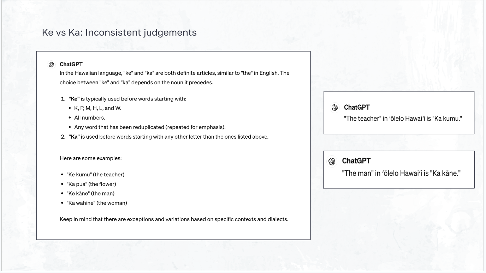
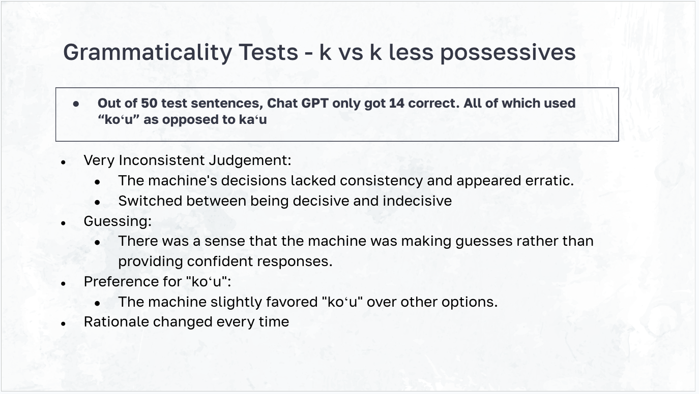
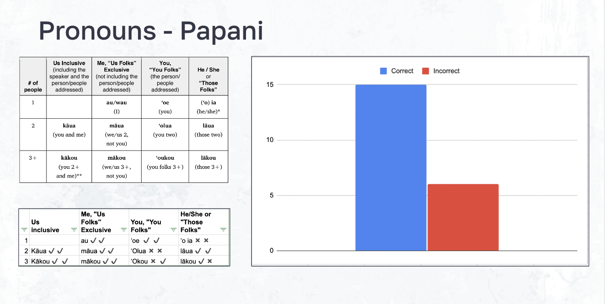

  
  
  

Experiment Summary: Understanding Hawaiian Language Nuances with AI
Objective:
To evaluate ChatGPT's ability to understand various grammatical aspects of the Hawaiian language, focusing on error patterns and comparing them to human learners' errors.

Procedure:

Curate Beginner Sentences: Selected sentences that beginners in Hawaiian might encounter.
Provide Correct Translations: Ensured accurate Hawaiian translations for reference.
Create Comparative Sentences: Developed sentences for comparison to test AI responses.
Request Evaluation from AI: Asked ChatGPT to evaluate the sentences.
Analyze Responses and Note Trends: Analyzed the AI’s responses for accuracy and consistency.
Draw Conclusions and Recommendations: Identified areas of strength and improvement for the AI.
Key Areas Tested:

Ke vs. Ka Usage, K-Possessives Versus K-Less Possessives, and inclusive vs exclusive pronouns

Testing specifically for exceptions to the KEAO rule. KEAO Rule: Nouns starting with K, E, A, O should be preceded by “ke” (e.g., ke kumu). Exceptions: Some words like “mele” (song), “puna” (spoon), and “pākaukau” (table) use “ke” despite not following the KEAO rule.
Evaluation: Created 20 unique prompts and tested each 5 times to account for potential AI variations.
Findings: ChatGPT did not follow the KEAO rule, not using "ke" at any time, diverging from typical human learning patterns. However, when asked "When to use Ke vs Ka in the Hawaiian language", the machine would currently explain the KEAO rule, but did not use it in generating sentences.
Pronouns (Inclusive vs. Exclusive):

Tested AI’s understanding of inclusive vs. exclusive pronouns.
Noted errors that mirrored common human mistakes, such as confusion between “mākou” and “kākou.”
Found inconsistencies in the AI’s interpretation of “ʻo ia” as “ʻoia.”
Findings: ChatGPT's issues with inclusive and exclusive pronouns mirrored common issues seen in beginner learner classes.
Possessives (Koʻu vs. Kaʻu):

K-Possessives (koʻu): Used for things beyond personal control.
K-Less Possessives (kaʻu): Used for things within personal control.
Evaluated AI’s ability to distinguish and correctly apply these possessives.
Findings: Inconsistent application of k-possessives vs. k-less possessives, highlighting areas for improvement.
Conclusions and Recommendations:
ChatGPT understands basic Hawaiian grammar rules but exhibits common and uncommon errors among human learners. Its understanding of definite articles (ke/ka) diverges from human learning patterns, while its issues with inclusive and exclusive pronouns mirror common issues seen in beginning learner classes. Continued training with a focus on exceptions to grammatical rules and more nuanced usage of possessives is recommended to enhance the AI’s proficiency.

Future Plans:
In discussions with William O'Grady, plans were made to propose further development of this project, aiming to build a Hawaiian language model. This model would use source materials like the nūpepa to encourage accessible learning of the Hawaiian language in adolescence and support language revitalization efforts.

A full presentation, along with all related documents and data entries, is available via email upon request.

Source: <a href="https://github.com/your-github-repo"><i class="large github icon"></i>your-github-repo</a>
